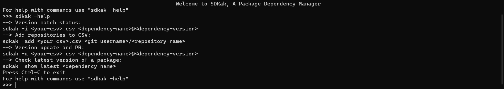

<!-- PROJECT LOGO -->
<br />
<div align="center">
  <a href="https://github.com/AK0055/Sdkak">
    
  </a>

<h3 align="center">SDKak</h3>

  <p align="center">
    A Python-based CLI tool for Package version management
    <br />
 
  </p>
</div>


<!-- TABLE OF CONTENTS -->
<details>
  <summary>Table of Contents</summary>
  <ol>
    <li>
      <a href="#about-the-project">About The Project</a>
      <ul>
        <li><a href="#built-with">Built With</a></li>
      </ul>
    </li>
    <li>
      <a href="#getting-started">Getting Started</a>
      <ul>
        <li><a href="#install">Installation and Prerequisites</a></li>
      </ul>
    </li>
    <li><a href="#usage">Usage</a></li>
    <li><a href="#roadmap">Roadmap</a></li>
    <li><a href="#contributing">Contributing</a></li>
    <li><a href="#license">License</a></li>
    <li><a href="#contact">Contact</a></li>
    <li><a href="#acknowledgments">Acknowledgments</a></li>
  </ol>
</details>


<!-- ABOUT THE PROJECT -->
## About The Project



To make it easier for developers to manage and update package dependencies for multiple projects, this project helps in minimising efforts through use of simple yet powerful commands to add repositories, check version status, modify dependencies and commit changes to each of remote repositories. Users can also check the latest version of a package in remote.

<p align="right">(<a href="#top">back to top</a>)</p>


### Built With

- [Python](https://www.python.org/)
- [NPM](https://www.npmjs.com/)
- [Git](https://git-scm.com/)
<p align="right">(<a href="#top">back to top</a>)</p>

<!-- GETTING STARTED -->
## Getting Started

Given below are some easy to use commands to help you get started with using the project.
<div id="install">

### Installation and Prerequisites
1. Clone the repo
    ```sh
     git clone https://github.com/AK0055/Sdkak.git
    ```
2. Install module dependencies
    ```sh
     pip install -r requirements.txt
    ```
3. NodeJS and NPM should be installed and configured
4. An Input CSV file present in root of project with the following structure
    <table>
    <tr>
      <th><b>name</b></th>
      <th><b>repo</b></th>
    </tr>
    <tr>
      <td>repo-name-1</td>
      <td>https://github.com/gitusername/repo-name-abc/</td>
    </tr>
    <tr>
      <td>repo-name-2</td>
      <td>https://github.com/gitusername/repo-name-xyz/</td>
    </tr>
  </table>
</div>
<p align="right">(<a href="#top">back to top</a>)</p>

<!-- USAGE EXAMPLES -->
## Usage
1. Start the application using
```sh
  cd Sdkak
  python3 main.py
  ```
2. Initialise the repositories in the CSV file present at root directory with the dependency and version you want to check
```sh
  sdkak -i <your-csv>.csv <dependency-name>@<dependency-version>
  ```
3. Add a repository and generate its URL to the repository list in the CSV file 
```sh
  sdkak -add <your-csv>.csv <git-username>/<repository-name>
  ```
4. Cloning individual repositories for those having outdated versions, creating a new branch, modify dependency to version specified in CLI and creating a PR
```sh
  sdkak -u <your-csv>.csv <dependency-name>@<dependency-version>
  ```
5. To check the latest version of an npm package dependency to cross check
```sh
  sdkak -show-latest <dependency-name>
  ```
6. For help in commands use
```sh
  sdkak -help
  ```
<p align="right">(<a href="#top">back to top</a>)</p>

                                
<!-- ROADMAP -->
## Roadmap

- [x] Version match status
    - [x] Initialise repositories from CSV
    - [x] Fetch remote package.json contents for dependency provided in commandline
    - [x] Compare versions
- [ ] Version update and PR
    - [x] Clone repositories
    - [x] Create a new branch for each repository
    - [x] Modify package.json contents for dependency provided in commandline
    - [x] Commit changes
    - [ ] Push changes to remote
- [x] Add repositories to CSV
    - [x] Get repository name from command
    - [x] Generate github URL for the repository
    - [x] Append contents to CSV file
- [x] Check latest version of a package
    - [x] Get package name from command
    - [x] Fetch latest version in remote for the package
